# 项目名称：基于C++和OpenCV实现的Windows平台图像处理系统
## 项目功能

## 项目功能描述

- [1] 菜单栏
    - [a] 灰度处理
        - [a1] RGB转灰度
        - [a2] 直方图均衡化
        - [a3] 灰度变换
            - [I] 线性变换
            - [II] 非线性变换
                - [1] 对数变换
                - [2] 伽马变换
    - [b] 形态学处理
        - [b1] 腐蚀
        - [b2] 膨胀
    - [c] 图像分割
        - [c1] 阈值分割
            - [I] 固定阈值
            - [II] 自适应阈值
        - [c2] 区域生长
        - [c3] 边缘检测
            - [I] Sobel算子
            - [II] Canny算子
    - [d] 滤波处理
        - [d1] 均值滤波
        - [d2] 中值滤波
        - [d3] 高斯滤波
    - [e] 人脸检测
        - [e1] 人脸识别
        - [e2] 图像检测
## 文件目录

``` txt
──┬───┬─ ImgSystem - 总文件夹
  │   ├───┬─ vs. - Visual Studio IDE项目缓存文件
  │   │   ├───── ImgSystem - 资源文件、源文件、调试日志缓存文件
  │   │   
  │   ├───┬─ ImgSystem.sln - Visual Studio 项目工程文件，可直接使用VS打开，注意版本
  │   │   
  │   ├───┬─ README.md - 项目说明文档
  └
________
```
# 项目细节

### 处理演示

### 启动界面

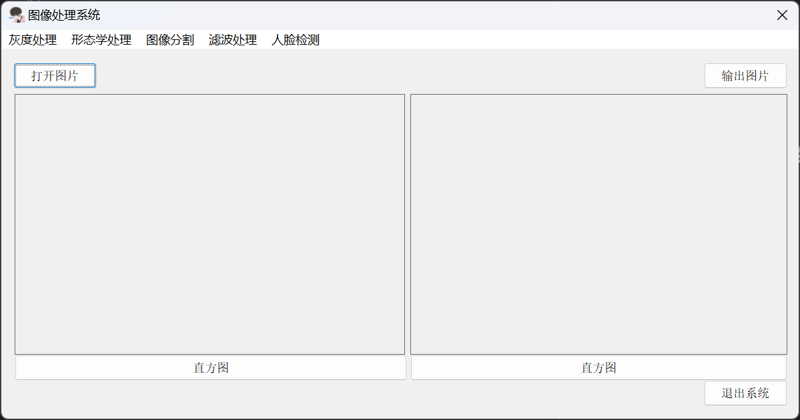

### 灰度处理

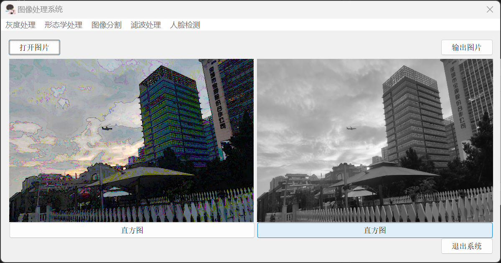
 
 ### 直方图均衡化

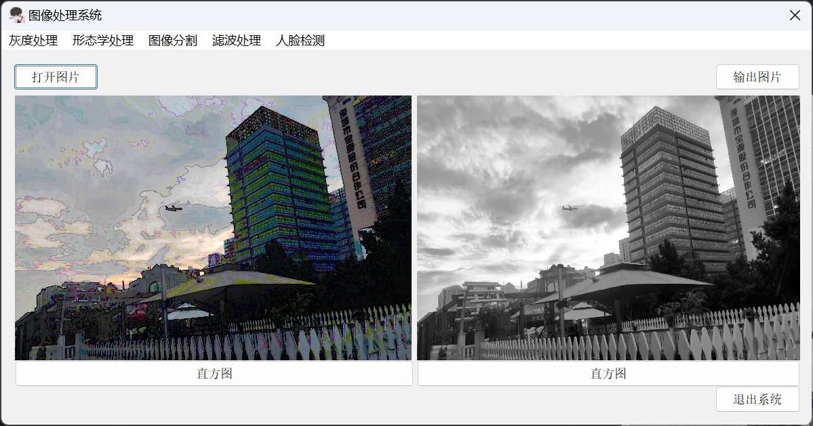
 ### 线性变换

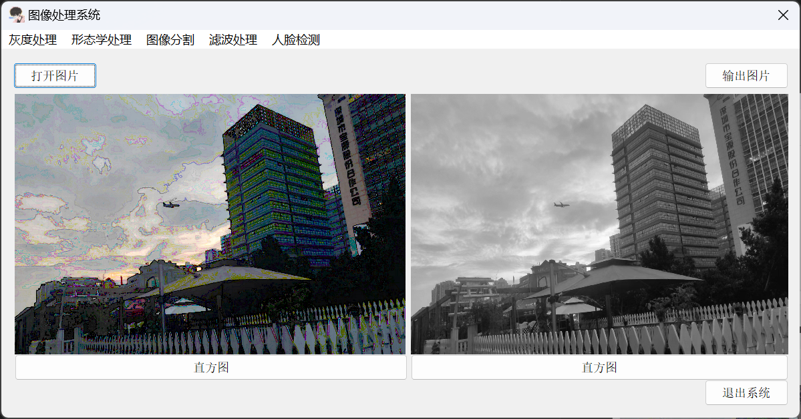
 ## 非线性变换
 ### 对数变换
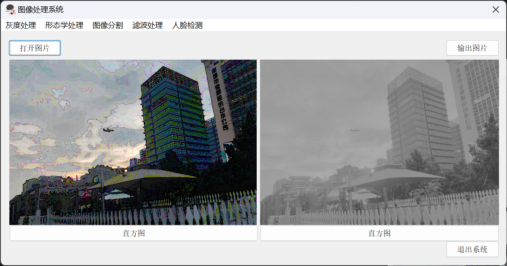
 ### 伽马变换


 ## 形态学处理
 ### 腐蚀

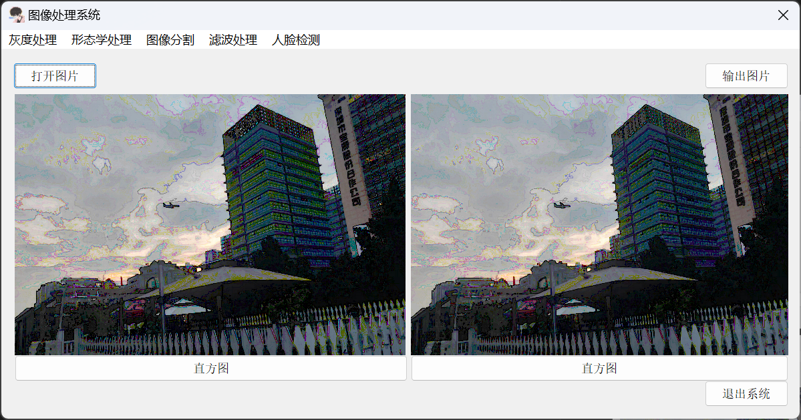

 ### 膨胀

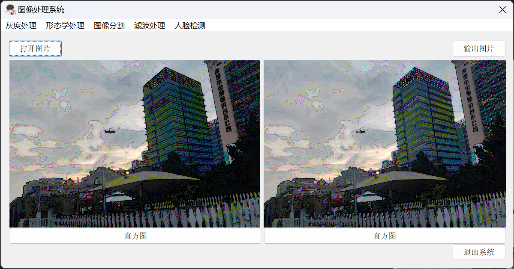

 ## 图像分割
 ### 阈值分割

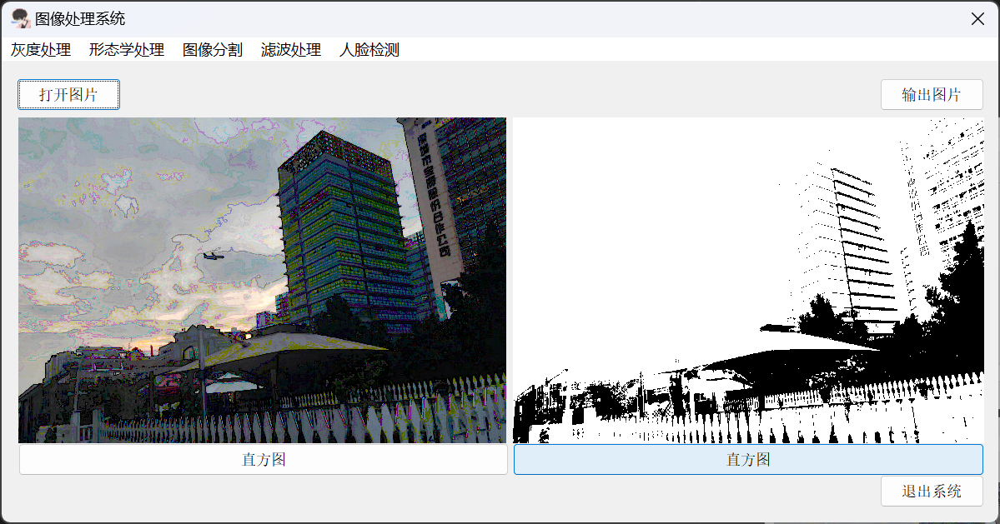
 ### 区域生长

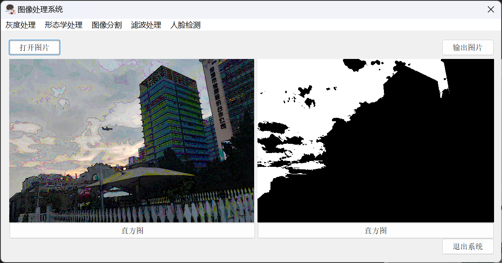

 ### 边缘检测

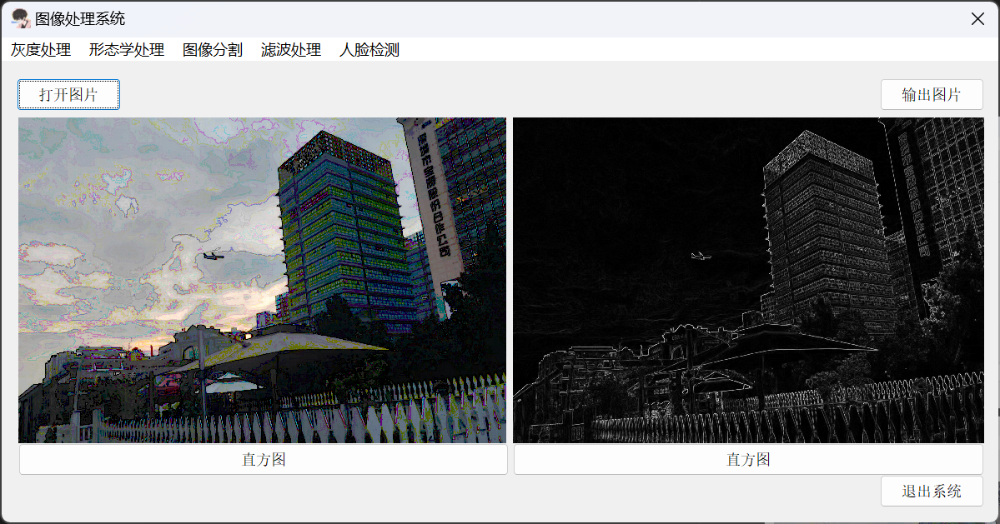

  ## 滤波处理
 
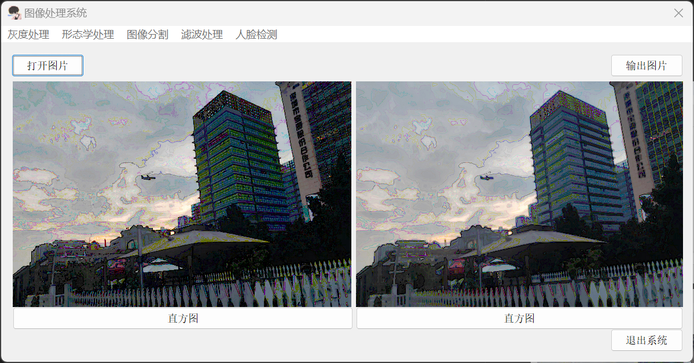
 ## 人脸检测
 
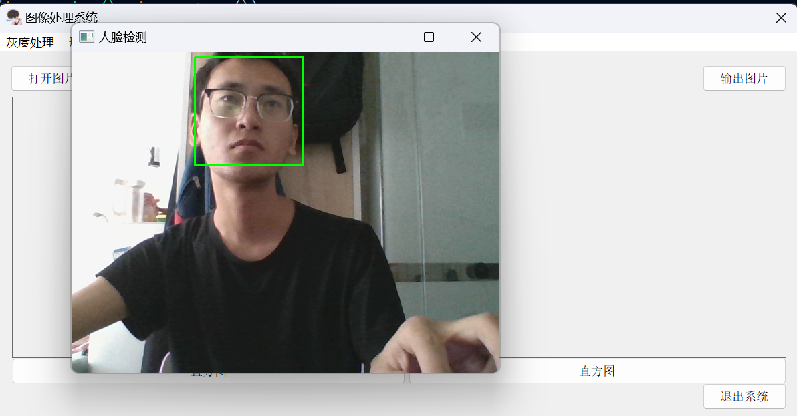
